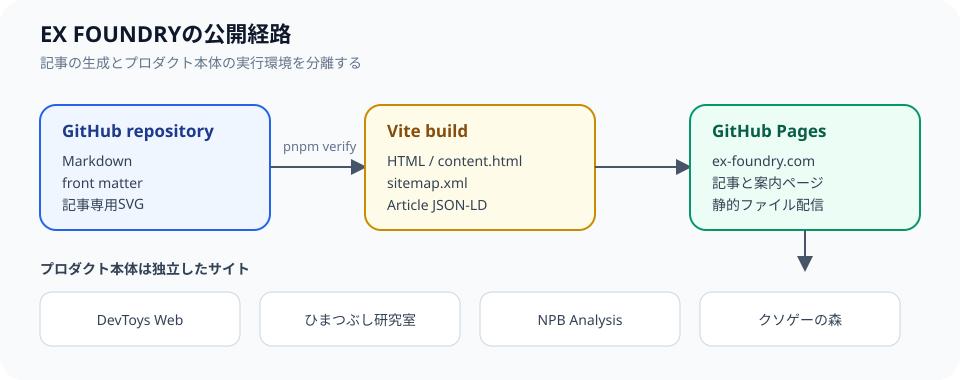

## 何を一つにまとめ、何を分けるか

EX FOUNDRYは、複数の個人開発プロダクトを見つけるための案内と、各プロダクトの公式な説明・技術構成・リリース情報を一つのドメインにまとめています。一方で、プロダクト本体はそれぞれのリポジトリとサブドメインで運用します。案内サイトとプロダクトを同じアプリケーションへ詰め込むのではなく、情報の責務と実行環境の責務を分ける設計です。

```text
ex-foundry.com
  ├─ プロダクト一覧・公式情報・リリース記事
  ├─ DevToys Web       → devtoys.ex-foundry.com
  ├─ ひまつぶし研究室  → maker.ex-foundry.com
  ├─ NPB Analysis      → npb-analysis.ex-foundry.com
  └─ クソゲーの森       → kusoge.ex-foundry.com
```

この分離により、プロダクト側のデプロイが互いに影響せず、EX FOUNDRYでは全体像と変更履歴を横断して説明できます。例えば、ゲーム側でWeb Workerの構成を変更しても、静的な記事サイトの配信処理を変更する必要はありません。反対に、記事の分類やサイト内検索を改善しても、プロダクト本体の機能テストを再実行する必要はありません。

ただし、分離はリンク切れや説明の不一致を自動的に防ぐものではありません。そのため、プロダクト紹介には実際の公開URLを置き、技術構成の記事にはプロダクト側のREADMEやarchitectureドキュメントへのリンクを置きます。公開前にはリンク、サービス名、ログイン要否、データ処理の説明を照合します。

## 記事の静的生成

記事はMarkdownで管理し、Viteのビルド時にHTMLへ変換します。front matterにはタイトル、日付、対象プロダクト、記事の種類、タグ、カバー画像を記録し、本文のMarkdownと一緒にビルドへ渡します。記事一覧、sitemap、canonical、JSON-LDは同じ記事データから生成するため、記事を追加すると公開URLの一覧にも自動的に反映されます。

```text
Markdown
  ↓ front matterを読み込む
記事メタデータ + 本文HTML
  ├─ トップページ
  ├─ プロダクト情報一覧
  ├─ 記事詳細の静的HTML
  ├─ sitemap.xml
  └─ Article / ItemList の構造化データ
```



### 記事データの最小単位

記事を追加するときは、本文だけでなく、どのプロダクトのどの種類の情報なのかをfront matterに記録します。次の例は、実際のファイルで使っている項目を抜き出した説明用の簡略例です。`contentType`を明示することで、紹介、技術構成、リリース、運用の記事を一覧で分類できます。

```yaml
title: "EX FOUNDRYのサイト構成"
path: "/entry/1002"
contentType: "architecture"
product: "ex-foundry"
tags: ["Vite", "GitHub Pages", "静的サイト"]
```

このメタデータは一覧カードの表示だけに使うのではありません。同じ入力から記事詳細のcanonical URL、sitemap、Articleの構造化データも生成します。そのため、本文を書いてから手作業でURL一覧を更新するのではなく、公開対象として認識された記事が各出力へ反映される構成になっています。

ブラウザ側では記事本文を個別のHTMLファイルから読み込むため、トップページのJavaScriptへ全記事本文を含めません。検索や分類は記事メタデータだけを使って実行します。これにより、トップページを開くために全記事を先に取得する必要がなくなり、一覧で見せたい情報と詳細ページで読む情報を分離できます。

記事の種類はプロダクト、技術構成、リリース、運用に分けています。これは見た目だけのラベルではなく、同じ内容を複数ページへコピーしないための編集上の境界です。プロダクトの現在の説明は紹介記事に集約し、変更の履歴はリリース記事へ、構成の理由は技術構成記事へ置きます。

## GitHub Pagesを選んだ理由

EX FOUNDRYの案内ページと記事は、リクエストごとのサーバー処理を必要としません。既知のURLをビルド時に生成できるため、GitHub Pagesの静的配信で構成を小さく保てます。訪問者ごとにデータベースを検索したり、ログインセッションを作ったりするサイトではないため、ページをファイルとして配信する方式が要件に合っています。

GitHub Actionsでは、変更をpushすると `pnpm verify` でフォーマット、型チェック、テスト、ビルドを実行します。成功した成果物だけをPagesへデプロイするため、手元の環境に依存しない公開手順になります。特にコンテンツ変更では、Markdownのfront matterの誤り、リンク先の不備、sitemapからの漏れ、静的HTMLに記事本文が含まれない問題をビルドで検出します。

GitHub Pagesの採用は、動的なプロダクトにも同じ方式を強制するという意味ではありません。NPB Analysisのように検索条件ごとにSQLiteを読むものは別の実行環境を使います。EX FOUNDRYは、プロダクトの構成を説明する場所として、静的サイトの制約と、動的アプリケーションが必要になる条件の両方を公開します。

## プロダクト側との違い

NPB AnalysisのようにSQLiteとSSRを必要とするプロダクトは、EX FOUNDRYと同じ静的構成を採用していません。プロダクトごとに必要な実行環境を選び、EX FOUNDRYではその違い自体を説明します。

構成を統一することより、要件に対して過不足のない配信方式を選べることを優先しています。情報サイトでデータベースを持つと更新経路や障害点が増え、逆に検索アプリケーションをすべて静的ページへ変換すると、更新のたびに大量のページを生成する必要があります。機能の性質に応じて構成を変え、その選択理由を記事に残すことが、サイト全体の説明責任につながります。
