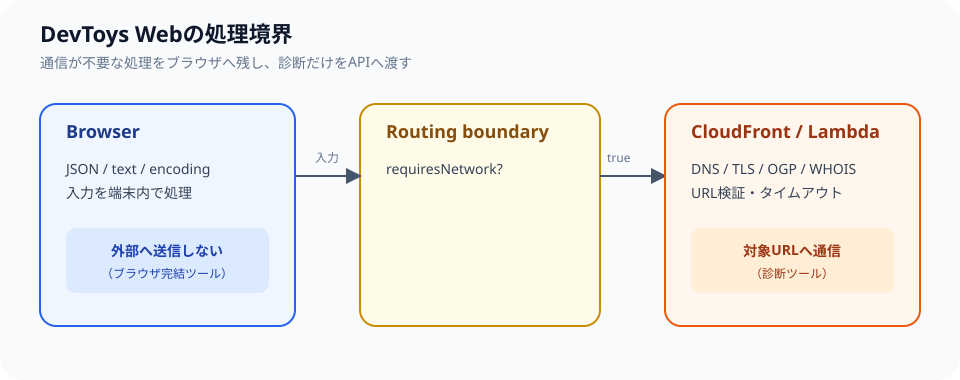

## 画面と診断APIを分ける

DevToys Webは、ブラウザ内で完結する変換ツールと、外部サイトへアクセスする診断ツールを同じ画面体験で提供します。ただし、両者を同じ実行経路にすると、静的に動かせるツールまでAPIへ依存します。そこで、入力した値だけで計算できる処理はWebアプリケーション側で実行し、外部ネットワークへ接続する処理だけをAPI側へ渡します。

```text
Browser
  ├─ JSON / text / encoding tools
  │    └─ ブラウザ内で処理
  └─ DNS / TLS / OGP / WHOIS / JWT tools
       └─ CloudFront /api/* → Lambda Function URL
```



実装では、ツールの定義に「ネットワーク通信が必要か」という性質を持たせ、実行経路を選ぶ判断を一か所に集約します。以下は実際のAPIクライアントやツール実装を転載したものではなく、責務の分け方を示す説明用の簡略例です。

```ts
type Tool = {
  requiresNetwork: boolean;
  runInBrowser: (input: string) => string;
  runThroughApi: (input: string) => Promise<string>;
};

async function runTool(tool: Tool, input: string): Promise<string> {
  if (!tool.requiresNetwork) {
    return tool.runInBrowser(input);
  }

  return tool.runThroughApi(input);
}
```

この分岐をUIの表示にも反映し、ブラウザだけで処理するツールには「入力は外部へ送信されない」、診断ツールには「対象URLへリクエストする」と説明します。経路をコードと画面の両方で明示することで、便利なツール集であることと、入力データの扱いを利用者が判断できることを両立します。

入力データを外部へ送る必要がないツールはクライアント側で計算します。DNSやTLS、外部HTMLを取得する機能は、ブラウザのCORS制約やネットワーク境界があるためAPI側へ分離します。この境界をUIにも表示することで、利用者が「入力はどこへ送られるのか」を判断できるようにします。

API側へ入力を渡す場合は、単にURLを受け取って取得するだけにはしません。URLの形式、プロトコル、ポート、リダイレクト、応答サイズ、タイムアウトなどを検証し、ローカルネットワークや意図しない宛先へアクセスする機能にならないようにします。エラー時には利用者が次に確認できる情報を返し、サーバー内部のスタックトレースや環境情報をそのまま表示しないことも重要です。

## モノレポと共有契約

リポジトリはpnpm workspaceとTurborepoで構成し、`apps/web`、`apps/api`、共有UI、API契約を分離しています。APIのリクエストとレスポンスは共有パッケージの型とzodスキーマを使い、ブラウザとLambdaの境界で検証します。

型だけに依存せず、外部入力は実行時にも検証します。TypeScriptの型はコンパイル時の開発者を助けますが、HTTPリクエストから届く値が正しいことまでは保証しません。そのため、共有契約に実行時スキーマを持たせ、ブラウザからのリクエスト、API内部の処理、レスポンスの表示をそれぞれ境界で確認します。

ツールを追加するときは、UIの入力欄だけを先に作らないようにしています。最初に入力値の性質、外部通信の有無、失敗時のレスポンス、テスト用モック、利用者への注意書きを決めます。その後で画面、API、共有契約を順に実装します。小さなツールでも、入力の扱いが曖昧なまま公開すると、使い方と実際の通信が食い違うためです。

## 配信とデプロイ

本番構成は、静的な画面をCloudFrontから配信し、`/api/*`だけをLambda Function URLへルーティングします。CloudFrontのOACでLambdaのURLを保護し、ブラウザへAWS認証情報を持たせません。画面の静的アセットとAPIの実行環境を分けることで、変換ツールの表示を軽く保ちながら、診断機能だけにサーバー処理を割り当てられます。

GitHub Actionsでは、Node.js 26とpnpm 11を使って検証し、AWS OIDCでデプロイします。長期アクセスキーをリポジトリへ保存しないこと、環境名を明示して誤ったAWS環境へデプロイしないことを運用上の制約にしています。Pull Requestではテスト、型チェック、ビルドを通し、APIのモックテストとWeb画面の確認を分けて行います。

## ツール追加時の判断

新しいツールを追加するときは、まずブラウザ内で安全に処理できるかを判断します。サーバー処理が必要な場合は、入力値の扱い、アクセス先の制限、エラー表示、テスト用モックを用意してから画面へ追加します。

この境界を保つことで、便利さを増やしながら、入力データを無条件に外部へ送るツール集にならないようにしています。新しい診断機能では、対象URLへ送る情報、外部から受け取る情報、保存の有無、結果の保持期間を説明できることを公開条件にします。ブラウザだけで実装できる機能については、不要なAPIを追加せずクライアント処理を優先します。

この構成の制約は、すべてのツールが同じように高速・常時利用できるわけではないことです。DNSやTLSなどの診断は対象サイトやネットワークの状態に左右され、APIのタイムアウトや外部サービスの制限も受けます。利用者には診断結果の意味と限界を説明し、結果を公式監視やセキュリティ監査の唯一の根拠にしないよう案内します。
