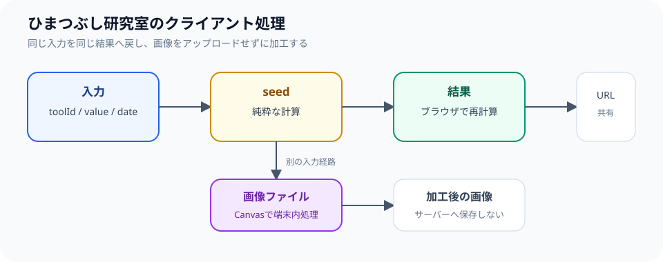

## サイトの前提

ひまつぶし研究室は、アカウントやデータベースを持たない静的サイトとして運用しています。React Routerのルートをビルド時にプリレンダーし、生成されたHTMLをS3とCloudFrontから配信します。利用者ごとの状態をサーバーに保存する前提を置かないことで、ログイン処理、データベースのバックアップ、個人データの削除機能をサイトの中心へ持ち込まずに済みます。

```text
GitHub Actions
  ↓ build / verify
静的HTML + JavaScript + asset
  ↓
S3 + CloudFront
```

## 入力から結果を再現する

診断やジェネレーターでは、入力とツール固有の識別子からシードを作り、結果を決定論的に生成します。ツール固有の識別子を含めるのは、同じ名前を別のツールへ入力したときに、異なる結果を作れるようにするためです。日付を入力に含めるツールでは、同じ名前でも日付が変われば別の結果になります。

同じ入力をもう一度使えば同じ結果になるため、サーバーに結果を保存しなくても共有URLを再現できます。結果をデータベースへ保存しないので、共有ページを開いたときはURLに含まれた入力を読み込み、ブラウザ側で再計算します。この方式は小さな結果カードを共有するには向いていますが、入力値そのものをURLへ含める場合にはプライバシー上の注意が必要です。

次のコードは、入力からシードを作り、そのシードから結果を選ぶ流れだけを示した説明用の簡略例です。実際の各ツールが使う文言や乱数処理をそのまま表したものではありません。

```ts
type GeneratorInput = {
  toolId: string;
  value: string;
  date?: string;
};

function createSeed(input: GeneratorInput): number {
  const source = `${input.toolId}:${input.value}:${input.date ?? ""}`;
  return [...source].reduce((seed, character) => seed * 31 + character.codePointAt(0)!, 7);
}

function choose<T>(items: readonly T[], seed: number): T {
  return items[Math.abs(seed) % items.length]!;
}
```

重要なのは乱数の実装方法ではなく、ツールID、入力値、必要なら日付という入力を固定して結果を再計算できることです。生成結果をサーバーのレコードとして持たないため、削除対象の共有データを管理する負担は減りますが、URLに入力値を含める設計ではURLの共有範囲に注意が必要です。



ただし、結果の再現性はツールの演出上の性質であり、診断内容の科学的な妥当性を意味しません。ネタ系のページではジョークであることを明示します。結果の表示が安定していることと、現実の人物・能力・相性を正確に説明できることは別の問題です。重要な判断に利用できるような表現を避け、遊びとしての範囲を越えないようにします。

## 画像処理はブラウザで行う

画像のリサイズ、切り抜き、加工はCanvasを使ってブラウザ内で行います。サーバーへ画像をアップロードしないため、処理後にサーバー側の保存データを削除する仕組みを必要としません。画像は利用者の端末から読み込み、Canvasへ描画し、必要な形式へ書き出して結果を表示します。

この方式でも、画像が完全に安全になるわけではありません。ブラウザのメモリ使用量、画像の解像度、端末の性能によっては処理に時間がかかります。また、保存した画像や共有したファイルには元画像の内容が残ります。ツール上で処理場所を説明し、公開したくない写真や個人情報を含む画像の扱いには利用者自身が注意する必要があります。

一方、ブラウザで扱えない処理を追加する場合は、個人情報やファイルの扱い、保存期間、エラー時の挙動を先に設計します。便利さだけを理由に、すべての入力をAPIへ送る構成にはしません。APIが必要な機能では、送信される値、処理が終わるまでの保持、ログへの記録、失敗時に返す情報をドキュメントへ追加してから実装します。

## 共有基盤を先に作る

ツールごとに結果カード、画像保存、URLコピー、SNS共有を個別実装すると、追加するたびに挙動がばらつきます。そのため、ツールレジストリと共通結果UIを整備し、個別ツールは入力と結果のロジックへ集中させる方針です。レジストリには、ツール名、ルート、説明、入力形式、結果の表示方式を登録し、一覧ページと個別ページの定義がずれないようにします。

共通UIを持つことで、結果のコピー、画像保存、共有URLの作成、モバイル画面での表示を同じ基準で改善できます。ただし、すべてのツールを同じ入力フォームへ押し込むことはしません。画像加工と名前診断では必要な説明が違うため、共通化するのは結果の扱いとナビゲーションのような横断要素に限定します。

詳細なロードマップはプロダクト側の[プロダクト方針](https://github.com/s-yoshiki/maker.ex-foundry.com/blob/main/docs/product.md)で管理しています。新機能を追加するときは、決定論的な結果を維持できるか、処理をブラウザ内に置けるか、入力値が共有URLへ露出しないか、モバイルで操作できるかを確認します。プロダクトの目的と実装が変わった場合は、EX FOUNDRY側の紹介記事と構成記事も更新します。
