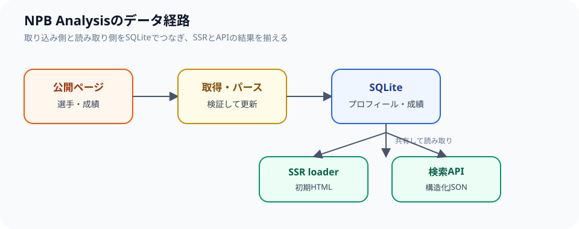

## 静的サイトでは足りない理由

NPB Analysisは、選手名や成績条件に応じてサーバー側でデータを検索します。選手数、年度、球団、指標の組み合わせをすべて事前に静的HTMLへ書き出そうとすると、更新のたびに生成対象が増え、条件を追加するたびにページ構成を作り直す必要が出てきます。そのため記事サイトのように全ページを静的HTMLへ書き出すのではなく、React RouterのSSR loaderからSQLiteを読み込む構成を採用しています。

```text
Browser
  ↓ request
React Router SSR loader
  ↓
SQLite（選手プロフィール・成績）
  ↓
HTML + API response
```



SSR loaderと外部APIは、同じ検索条件を受け取っても、データベースへの読み取りを共有コアへ寄せる構成にしています。以下はSQLiteのテーブル名や列を簡略化した説明用のコードで、実際のクエリをそのまま載せたものではありません。

```ts
type Search = { playerName?: string; season?: number };

function findPlayers(database: Database, search: Search) {
  return database
    .prepare(
      `SELECT id, name, season, batting_average
         FROM player_records
        WHERE (:playerName IS NULL OR name LIKE :playerName)
          AND (:season IS NULL OR season = :season)
        ORDER BY season DESC`,
    )
    .all({
      playerName: search.playerName ? `%${search.playerName}%` : null,
      season: search.season ?? null,
    });
}
```

実際の境界では、検索条件をスキーマで検証し、取得できない値やデータベースエラーを利用者向けの結果と分けています。SSRではこの検索結果を初期HTMLへ含め、APIでは同じコアロジックの結果を契約に従うJSONへ変換します。画面とAPIが別々のSQLを持たないことが、結果のずれを抑えるポイントです。

## 取り込みから検索まで

データパイプラインは、公開ページから選手情報と成績を取得し、SQLiteへ直接登録・更新します。取得、パース、保存、検索の責務を分け、HTMLの表記が変わったときにどの段階で失敗したかを確認できるようにしています。中間JSONを正とせず、Web、API、デプロイが同じSQLiteファイルを参照することで、読み取り側と更新側の対象を揃えています。

更新時には、少数件のデバッグ取得でページ構造を確認してから全体の処理へ進みます。選手名、所属、年度、打撃成績、投手成績の代表例を検証し、空欄が正しい値なのか、パース失敗で欠けた値なのかを区別します。SQLiteへ登録した後は、検索条件を変えた結果、個別ページ、ランキング、SSRで返すHTMLが同じファイルを参照しているかどうかを確認します。

スクレイピング時にはアクセス間隔を設定し、開発時の検証は少数件のデバッグ取得に限定しています。全件更新はデータの変化を確認したうえで実行します。対象サイトへの負荷を抑えること、取得元の利用条件を確認すること、取得できない状態を空データで上書きしないことを運用上の前提にしています。

## WebとAPIの責務

WebはSSR loaderから共有のコアロジックを呼び出して初期HTMLを作ります。外部から利用する検索APIは、別のHonoアプリとして提供しています。ブラウザからAPIを呼ぶ場合も、入力の形式と結果のスキーマを境界で検証します。

この構成には、内部のSSR表示までHTTP経由にするよりもサーバー内の読み取りを単純に保てるという利点があります。SSRでは初回表示に必要な検索結果をHTMLへ含め、ブラウザがJavaScriptを実行する前でもページの概要を読めるようにしています。外部から利用するAPIは、検索条件を受け取って構造化された結果を返す責務に限定しています。

一方で、SSRとAPIで結果の形式がずれないよう、共有契約とテストを維持しています。入力条件が不正な場合、データが見つからない場合、SQLiteが読めない場合をそれぞれ区別し、内部のファイルパスやスタックトレースをレスポンスへ含めないようにしています。

## データの注意点

選手の所属や成績は更新されるため、ページには参照時点を示しています。取得元の公開ページが変更された場合や、過去のデータが訂正された場合は、アプリケーション側の更新が追いつくまで差分が残ることがあります。NPB Analysisは分析と検索のための個人開発サービスであり、公式記録の代替ではありません。必要に応じて、各団体・球団の公開情報と照合してください。

この構成で重視しているのは、データ量の多さだけではありません。どの処理でデータが作られ、どのファイルを画面とAPIが読み、いつ更新されたかを追跡できることです。この境界を保つことで、検索機能を追加したときも、表示だけを変更したときも、既存データへの影響を確認しやすくなります。
