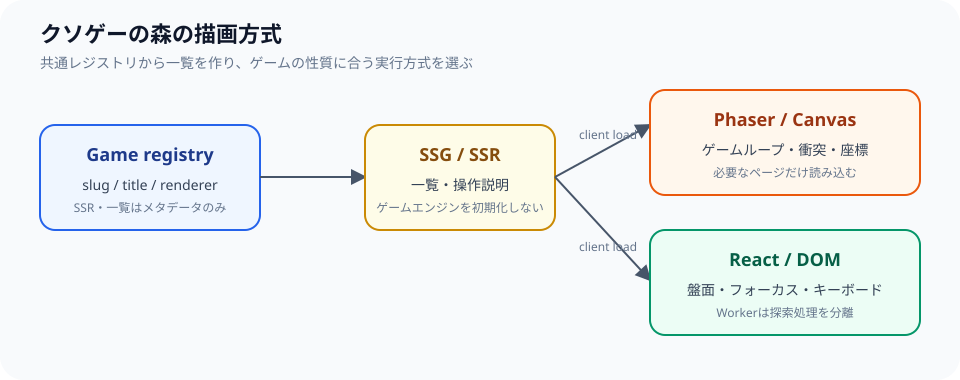

## Phaserを前提にしない

クソゲーの森では、すべてのゲームを同じ描画エンジンへ乗せるのではなく、ゲームの性質に応じて方式を選びます。毎フレーム動くゲームや当たり判定が必要なものにはPhaserを使い、静的な盤面をクリックするオセロにはDOMを使うといった具合です。描画方式を統一することよりも、ゲームループが必要か、入力を要素として扱いたいか、アクセシビリティやテーマの仕組みをそのまま使えるかを基準に選んでいます。

| ゲームの性質 | 描画方式 | 理由 |
| --- | --- | --- |
| 座標、速度、衝突、毎フレーム更新 | Phaser / Canvas | ゲームループと描画をまとめやすい |
| 盤面を選び、手番を進める | React / DOM | キーボード、読み上げ、テーマをそのまま使える |

## packagesへゲーム本体を分離する

ゲームのルールや設定は `packages/<game-name>` に分け、サイトのルーティングやデプロイ処理から独立させています。サイト側はゲームの名前、説明、公開パス、操作方法のようなメタデータをレジストリから読み込み、ゲーム本体の実行ロジックとは分離しています。そのため、一覧ページを生成するときに各ゲームの描画エンジンを実行する必要がありません。

Phaserを使うゲームでは、SSR時にPhaserを読み込まないよう、メタデータとクライアント起動コードを別の入口に分けています。PhaserはブラウザのCanvasやゲームループを必要とするため、サーバーやプリレンダー環境で初期化すると、windowやdocumentがないことによるエラーが起きてしまいます。そこでサーバー側は説明とルートだけを生成し、ブラウザでページがマウントされたあとにゲームを起動します。

```text
packages/game
  ├─ metadata / config  ← SSRから安全に読み込む
  ├─ scene / create-game
  └─ client              ← ブラウザでだけ読み込む
```



ゲームの一覧とルートを一つのレジストリから生成すれば、サイト側がゲーム内部の描画エンジンへ依存せずに済みます。次は、メタデータを使う境界を示す説明用の簡略例です。

```ts
type GameDefinition = {
  slug: string;
  title: string;
  renderer: "phaser" | "dom";
  loadClient: () => Promise<unknown>;
};

const games: readonly GameDefinition[] = [
  { slug: "runner", title: "ランナー", renderer: "phaser", loadClient: loadRunner },
  { slug: "othello", title: "オセロ", renderer: "dom", loadClient: loadOthello },
];
```

SSGやSSRが参照するのは`slug`、`title`、操作説明のような安全なメタデータだけにし、`loadClient`はブラウザでゲームページを開いたあとに呼び出します。これにより、ゲームエンジンを使わない一覧ページまでCanvas初期化の影響を受けることがなく、ゲームごとのチャンク分割も維持できます。

オセロのようなDOMゲームでは、ルールとAIを純粋なTypeScriptとして保持しています。盤面の状態、合法手、石をひっくり返す処理、勝敗判定をUIコンポーネントから分離することで、表示を変更してもルールのテストを再利用できます。8×8固定の定数にせず盤面のサイズを扱えるようにすることで、設定変更がUI全体へ波及しないようにしています。

DOMを使うゲームでは、盤面をボタンや要素として表現できるため、フォーカス、キーボード操作、ラベル、テーマの仕組みをそのまま利用できます。一方で毎フレーム大量の要素を更新するゲームには向かず、ゲームの性質に合わないDOM化はかえって処理負荷と実装量を増やします。描画方式の違いを隠すのではなく、ゲームごとに理由を明示することを設計上の判断にしています。

## SSGとWeb Worker

トップ、ゲーム一覧、既知のゲームURLはビルド時にプリレンダーします。初回表示ではゲームエンジンの読み込みを待たせず、ゲーム本体はマウント後に必要なチャンクだけを読み込みます。ゲーム一覧や操作説明は先にHTMLとして読めるため、利用者はJavaScriptのゲームコードが準備される前でも何を遊べるかを確認できます。

オセロの高い難易度ではAI探索が長くなるため、探索をWeb Workerへ分離しています。メインスレッドを止めず、考え中の表示やテーマ切り替えを維持するためです。Workerとの通信では盤面のコピーと探索結果の受け渡しが必要になるため、キャンセル、連続クリック、ゲーム終了後の遅いレスポンスといったケースも考慮しています。難易度を上げることだけを優先せず、操作が固まったように見えないことを重視しています。

静的生成には、公開URLを一覧へ登録し忘れるとページそのものが生成されない、という制約があります。ゲームを追加するときは、パッケージ、レジストリ、ルート、操作説明、ビルド成果物をあわせて確認します。

実装方式の詳細はプロダクト側の[architecture.md](https://github.com/s-yoshiki/kusoge/blob/main/docs/architecture.md)で更新しています。EX FOUNDRYでは利用者向けの概要と変更点を掲載し、細かい実装の契約やパッケージの構成はリポジトリのドキュメントを正としています。設計が変わったときは、両方の説明が矛盾しないように更新します。
